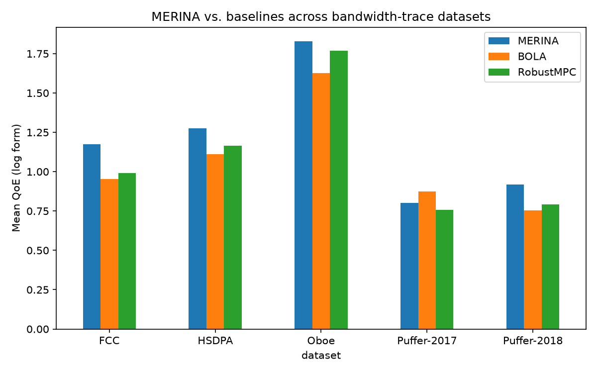
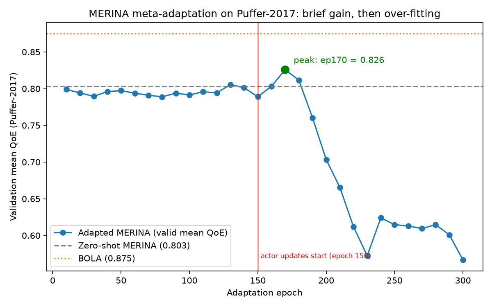
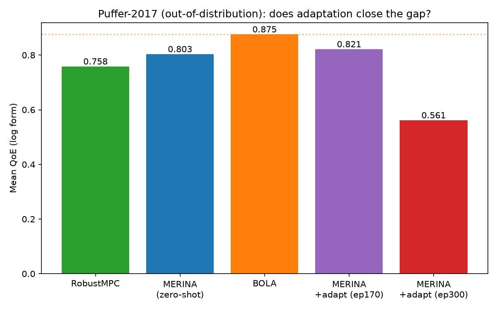

# MERINA — Reproduction & Extension Study

> This is a **reproduction project**, not the original authors' official repository. This document records how we reproduced the original code, the modifications required to run it, and the additional comparison experiments and analysis we built on top of the original paper.

---

## 1. Source & Attribution

This project reproduces the following work. All methods, network architectures, and pretrained models come from the original authors:

- **Original code**: [confiwent/merina](https://github.com/confiwent/merina) (MIT License, © 2022 Nuowen Kan)
- **Paper**: *Improving Generalization for Neural Adaptive Video Streaming via Meta Reinforcement Learning*, Nuowen Kan et al., **ACM MM 2022 (Top Rated Paper)** — [DOI](https://dl.acm.org/doi/abs/10.1145/3503161.3548331)
- **Bandwidth trace datasets**: [confiwent/Real-world-bandwidth-traces](https://github.com/confiwent/Real-world-bandwidth-traces) (FCC / HSDPA / Oboe / Puffer)
- The original README is preserved in full as [`README_UPSTREAM.md`](README_UPSTREAM.md).

MERINA's core idea: use **meta reinforcement learning** + a **conditional VAE latent** to train an adaptive bitrate (ABR) policy that generalizes better to **unseen network distributions**, and supports lightweight online adaptation to new environments (`--adp`).

---

## 2. What We Changed, and Why

> Principle: **no blind fork-copy.** Every change is motivated by a real problem hit during reproduction, or by the need to support reproducible comparison experiments. Changes are focused, minimal, and do not alter the method itself.

| # | Files | Change | Why |
|---|------|------|--------|
| 1 | `algos/test_v5.py`, `algos/test_v5_light.py`, `main.py`, `imrl_light.py` | Add `map_location` to every `torch.load(...)` (fall back to CPU when CUDA is unavailable) | The pretrained checkpoints were saved on a GPU, and the original `torch.load` had no `map_location`. On a CPU-only machine it crashes with `Attempting to deserialize object on a CUDA device`, which **completely blocks evaluation**. This was the first blocker in reproduction. |
| 2 | `main.py` | Add `--max-epochs N`; `algos/train_ppo_v6.py` `break`s once that epoch is reached | The original training is a `while True:` infinite loop and the README requires a **manual Ctrl+C** to stop. That is fatal to automated, reproducible experiments — you cannot script it or guarantee two runs train for the same number of steps. Default `0` preserves the original infinite-loop behavior (backward compatible). |
| 3 | `main.py` | Add `--act-model` / `--vae-model` to specify arbitrary checkpoint paths in `--test` mode | The original `test()` **hard-codes** the model paths to the shipped pretrained models. To evaluate a checkpoint we adapted ourselves (`--adp`), the only option was to overwrite the factory model file. The override flags let us evaluate any checkpoint without destroying the originals. |
| 4 | `utils/compare_schemes.py` *(new)* | Aggregate mean QoE per scheme × dataset; output a comparison table (CSV) + bar chart | The original `utils/plt_v2.py` only plots single figures and cannot produce a cross-dataset comparison table. The parsing logic strictly follows the original `test_v5.py` convention (per-trace mean of `reward[4:]`, then averaged across traces). |
| 5 | `utils/adp_analysis.py` *(new)* | Parse the adaptation validation log; plot the **adaptation learning curve** and a Puffer comparison | Used to answer the question "can online adaptation close the gap on Puffer?" (see Section 4). |

> The `if epoch >= 150:` gate in the original code (relevant to change #2) is important: **for the first 150 epochs only the critic is trained — the actor/VAE are not updated at all.** This explains why short runs show no policy change; any adaptation experiment must train well past epoch 150.

---

## 3. Reproduction Results: Cross-Dataset Comparison

Using the shipped log-QoE pretrained model, we evaluate MERINA on 5 real-world bandwidth datasets and compare against two classic baselines (**BOLA**, **RobustMPC**). The metric is the **log-form QoE** used in the paper (higher is better).

| Dataset | MERINA | BOLA | RobustMPC |
|--------|:------:|:----:|:---------:|
| FCC          | **1.175** | 0.952 | 0.990 |
| HSDPA        | **1.274** | 1.111 | 1.164 |
| Oboe         | **1.827** | 1.626 | 1.770 |
| Puffer-2017  | 0.803 | **0.875** | 0.758 |
| Puffer-2018  | **0.917** | 0.753 | 0.793 |



**Analysis:**
- On in-distribution / nearby datasets (FCC, HSDPA, Oboe, Puffer-2018), MERINA consistently beats both baselines, reproducing the paper's main result.
- **The one exception is Puffer-2017.** The shipped model was trained only on FCC+HSDPA, so Puffer-2017 is **out-of-distribution**, and there MERINA (0.803) actually **loses to BOLA (0.875)**. This exposes exactly the generalization problem the paper sets out to solve, and motivates the online-adaptation experiment in the next section.

---

## 4. Extension: Can Online Adaptation (`--adp`) Close the Puffer Gap?

To address the Puffer-2017 weakness found above, we run MERINA's meta-adaptation on the Puffer-2017 training traces for 300 epochs (validating on the Puffer-2017 test set every 10 epochs):

```bash
python main.py --adp --log --name merina_adp --max-epochs 300
```





| Scheme | Puffer-2017 mean QoE | vs. zero-shot MERINA |
|------|:--------------------:|:----------------:|
| RobustMPC            | 0.758 | −5.6% |
| MERINA (zero-shot)   | 0.803 | — |
| **MERINA + adapt (ep170, best)** | **0.821** | **+2.2%** |
| BOLA                 | 0.875 | +9.0% |
| MERINA + adapt (ep300, over-trained) | 0.561 | −30.1% |

**Conclusions:**
1. **Adaptation helps, but only modestly.** The best checkpoint (epoch 170) raises Puffer-2017 QoE from 0.803 to **0.821**, closing part of the gap — but **still does not catch up to BOLA (0.875)**.
2. **Naive PPO fine-tuning over-fits / diverges.** From the curve, once the actor starts updating at epoch 150, QoE briefly peaks around epoch 170 and then **collapses steadily** to 0.561 by epoch 300. The validation 5th-percentile also degrades from −1.6 to −2.7, indicating catastrophic behavior on hard traces.
3. **The value of reproducibility.** With the original "manual Ctrl+C" approach it is easy to stop at the wrong point and end up with an adapted model that looks *worse*. The `--max-epochs` flag plus full validation curve make it clear that the **best early-stopping point is epoch 170** — itself a takeaway from engineering the reproduction.

> This is a deliberately **measured and honest** reproduction conclusion: adaptation has a positive effect, but simply training longer does not let the RL method reliably beat the heuristic BOLA out-of-distribution; over-training is actively harmful.

---

## 5. How to Reproduce

```bash
# 1. Environment (CPU is enough; thanks to change #1, GPU-saved models load fine)
python3 -m venv .venv && source .venv/bin/activate
pip install torch numpy pandas tqdm seaborn matplotlib tensorboard

# 2. Prepare trace data (symlink or download into envs/traces/)
#    Data from https://github.com/confiwent/Real-world-bandwidth-traces

# 3. Cross-dataset evaluation (MERINA + baselines)
for f in tf t3g to tp tp2; do python main.py --test --$f --log; done
cd baselines && for f in tf t3g to tp tp2; do python Bola_v3.py --$f --log; python rmpc.py --$f --log; done && cd ..
python utils/compare_schemes.py        # -> Results/comparison_table.csv + comparison_chart.png

# 4. Puffer online-adaptation experiment
python main.py --adp --log --name merina_adp --max-epochs 300
python main.py --test --tp --log --name merina_adp \
    --act-model ./Results/sim/merina_adp/policy_merina_adp_170.model \
    --vae-model ./Results/sim/merina_adp/VAE_merina_adp_170.model
python utils/adp_analysis.py           # -> Results/adp_curve.png + adp_puffer_bar.png
```

## 6. Artifacts

- `Results/comparison_table.csv` — cross-dataset mean-QoE comparison table
- `Results/comparison_chart.png` — bar chart of the table above
- `Results/adp_curve.png` — Puffer-2017 adaptation learning curve (with best early-stop point annotated)
- `Results/adp_puffer_bar.png` — per-scheme comparison on Puffer-2017
- `utils/compare_schemes.py`, `utils/adp_analysis.py` — the analysis scripts we added
